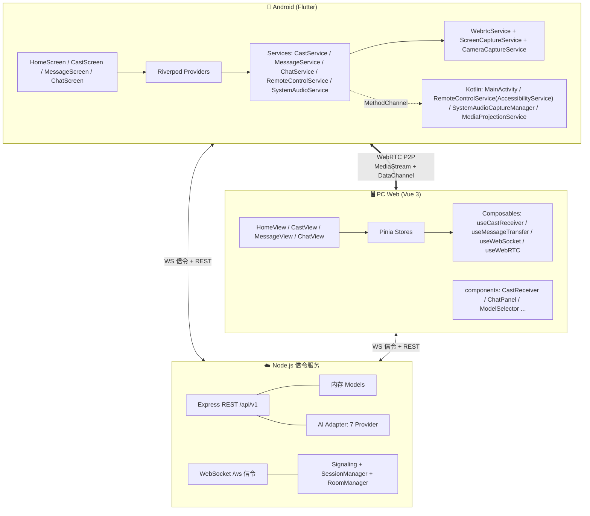
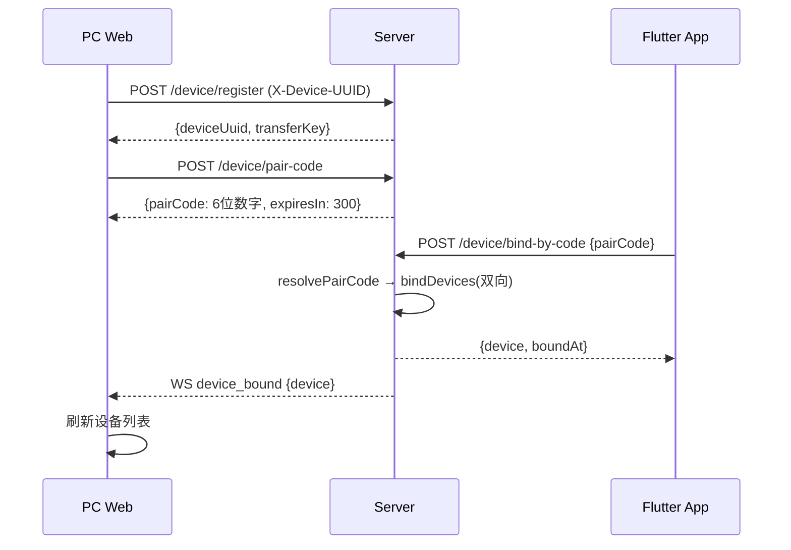
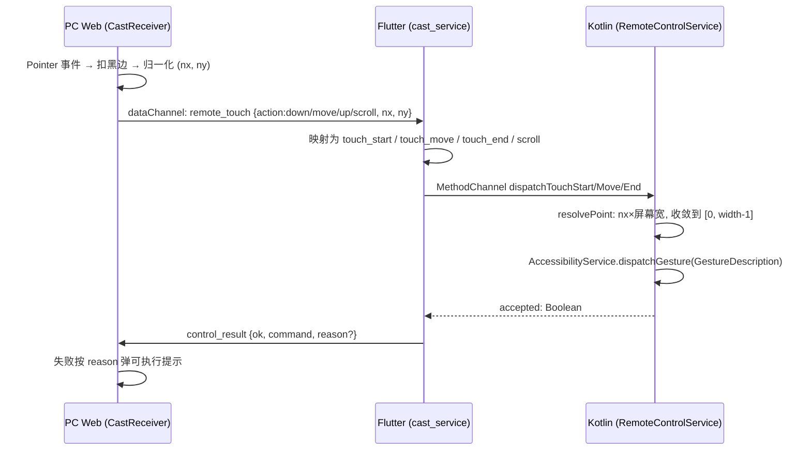
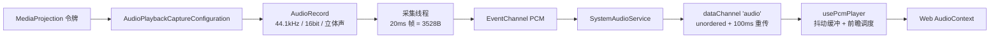

# AI Cast Hub

跨设备 AI 协作平台 —— 手机屏幕实时投屏到浏览器 + Web 端远程触控手机 + P2P 文件/消息传输 + 多模型 AI 对话。

三端组成：**Flutter Android App**（被控端/采集端）· **Vue 3 PC Web**（控制端/展示端）· **Node.js 信令服务**（配对、房间、中继）。

---

## 目录

- [1. 整体架构](#1-整体架构)
- [2. 技术选型](#2-技术选型)
- [3. 功能模块总览](#3-功能模块总览)
- [4. 核心功能链路](#4-核心功能链路)
  - [4.1 设备配对与绑定](#41-设备配对与绑定)
  - [4.2 屏幕投屏](#42-屏幕投屏)
  - [4.3 远程触控](#43-远程触控)
  - [4.4 系统内录音频](#44-系统内录音频)
  - [4.5 P2P 消息与文件传输](#45-p2p-消息与文件传输)
  - [4.6 AI 多模型对话](#46-ai-多模型对话)
  - [4.7 设备在线状态与自动解绑](#47-设备在线状态与自动解绑)
- [5. 协议规范](#5-协议规范)
  - [5.1 REST API](#51-rest-api)
  - [5.2 WebSocket 信令](#52-websocket-信令)
  - [5.3 DataChannel 应用协议](#53-datachannel-应用协议)
- [6. 数据模型](#6-数据模型)
- [7. Android 原生层](#7-android-原生层)
- [8. 目录结构](#8-目录结构)
- [9. 关键时间常量](#9-关键时间常量)
- [10. 本地开发](#10-本地开发)
- [11. 部署](#11-部署)
- [12. 环境变量](#12-环境变量)
- [13. 已知限制与死代码](#13-已知限制与死代码)

---

## 1. 整体架构



**关键架构决策**

| 决策 | 说明 |
|------|------|
| 信令走服务端，媒体走 P2P | 服务端只负责配对/SDP/ICE 交换；音视频与文件数据全程 WebRTC DataChannel/MediaStream 直连，不经服务器 |
| 手机端是投屏发起方 | `create_room {type:'cast'}` 由 Flutter 发起，PC 被动接受邀请 |
| 消息链路双方都可发起 | PC 用统一入口 `startConnectDevice()`，手机用 `MessageService.connect()` |
| 控制与数据分通道 | 投屏：`control`(JSON) + `audio`(二进制 PCM)；消息：`message`(控制) + `file-0/1/2`(并行分片) |
| 服务端无数据库依赖 | 当前全部模型为内存 Map，MySQL 连接池已配置但未接入业务层 |

---

## 2. 技术选型

### 后端 `server/`

| 类别 | 选型 | 版本 | 用途 |
|------|------|------|------|
| 运行时 | Node.js | 20 (Alpine) | — |
| Web 框架 | Express | ^4.18.2 | REST |
| WebSocket | ws | ^8.16.0 | `/ws` 信令 |
| 参数校验 | Zod | ^3.22.0 | 4 个 schema |
| 日志 | Winston | ^3.12.0 | console + error.log + combined.log |
| 限流 | express-rate-limit | ^7.2.0 | 全局 15min/500（dev 1000）、chat 1min/20 |
| 数据库 | mysql2 | ^3.9.0 | **连接池已建，业务层未接入** |
| 容器 | dockerode | ^4.0.0 | 沙箱（未启用） |
| AI SDK | openai / @anthropic-ai/sdk / @google/generative-ai | ^4.40 / ^0.25 / ^0.10 | 7 家 Provider |
| 加密 | node:crypto | 内置 | AES-256-GCM 加密 API Key |

### PC Web `pc-web/`

| 类别 | 选型 | 版本 |
|------|------|------|
| 框架 | Vue 3 | ^3.4.0 |
| 构建 | Vite | ^5.2.0 |
| 状态 | Pinia | ^2.1.0 |
| 路由 | vue-router | ^4.3.0 |
| 样式 | TailwindCSS | ^3.4.0 |
| HTTP | axios | ^1.6.0 |
| 测试 | vitest + @vue/test-utils | ^4.1.8 / ^2.4.11 |

> `@vueuse/core`、`qrcode` 已声明但代码无引用（历史冗余）。

### 移动端 `flutter-app/`

| 类别 | 选型 | 版本 |
|------|------|------|
| SDK | Flutter / Dart | `>=3.2.0 <4.0.0`（CI 用 3.29.0） |
| 状态 | flutter_riverpod | ^2.5.0 |
| WebRTC | flutter_webrtc | ^1.5.0 |
| HTTP/SSE | dio | ^5.4.0 |
| WebSocket | web_socket_channel | ^2.4.0 |
| 本地库 | sqflite + shared_preferences | ^2.3.0 / ^2.2.0 |
| 权限 | permission_handler | ^11.0.0 |
| 文件 | file_picker + path_provider + path | ^8.0.0 / ^2.1.0 / ^1.9.0 |
| 摘要 | crypto | ^3.0.0（MD5 / SHA-256） |
| 其他 | uuid / url_launcher / network_info_plus | ^4.0.0 / ^6.2.0 / ^6.0.0 |

**Android 编译配置**：`compileSdk 36` · `minSdk 24` · `targetSdk` 跟随 Flutter · `ndkVersion 27.0.12077973` · Kotlin JVM 17 · CI 只编 `arm64-v8a`。

### 基础设施

| 组件 | 用途 |
|------|------|
| Nginx | 托管 `pc-web/dist` 静态资源 + 反向代理 `/api`、`/ws` |
| PM2 | 守护 Node 服务（`ai-cast-server`） |
| Coturn | TURN 中继（**可选**，未部署时保持配置为空） |
| MySQL 8 | 预留，见「已知限制」 |
| GitHub Actions | ① push master 自动构建 `app-arm64-v8a-debug.apk`（保留 7 天）；② 手动触发正式签名 Release 流水线（APK/AAB + GitHub Release） |

---

## 3. 功能模块总览

### PC Web 模块

| 路由 | 页面 | 职责 |
|------|------|------|
| `/` | `HomeView` | 6 位连接码展示与刷新、已配对设备列表（在线点/离线时间/尝试连接/解绑）、三步配对引导 |
| `/cast` | `CastView` | 投屏接收：画面渲染、画质切换、系统声音开关、快捷控制按钮（Home/Back/多任务/音量/截图/电源/停止） |
| `/message` | `MessageView` | P2P 文本与文件收发：连接状态条、统一连接入口、进度与分片数、下载/移除、已读回执 |
| `/chat` | `ChatView` | AI 对话：会话列表、流式气泡、模型选择、Token 统计 |

**组件分类**

- 通用：`common/Spinner`
- 投屏：`cast/CastReceiver`、`cast/ConnectionBadge`、`cast/DevicePairCode`
- 聊天：`chat/ChatPanel`、`chat/ConversationList`、`chat/ChatMessage`、`chat/ChatInput`、`chat/ModelSelector`、`chat/TokenUsage`
- 文件：`file/FileReceivePanel`（未挂载）、`file/ProgressBar`

**Composables**

| 文件 | 职责 |
|------|------|
| `useWebSocket` | 全局 WS 单例：认证、心跳 30s/60s、指数退避重连（上限 30s）、4000-4003 不重连 |
| `useWebRTC(namespace)` | 每 namespace 一个 PeerConnection；Offer/Answer/ICE、DataChannel、`setIceServers` |
| `useCastReceiver` | 投屏接收全链路：邀请处理、轨道绑定、control/audio 通道、画质下发、弱网降档 |
| `useMessageTransfer` | 消息+文件 P2P 全链路（单例）：双协议栈、并行分片、MD5 校验、断点续传 |
| `useDeviceConnect` | 统一「主动连接 App」入口：状态守卫 + 强制重置 + toast + 异常捕获 |
| `usePcmPlayer` | PCM 播放：抖动缓冲 6 帧、前瞻 0.3s、队列上限 50 帧 |
| `castQuality` | 画质档位：`high 1920×1080@30 4Mbps` / `medium 1280×720@30 2Mbps` / `low 854×480@15 800kbps` |
| `useSSE`、`useFileTransfer` | 历史遗留，**无调用方** |

**Pinia Stores**

| Store | 关键状态 |
|-------|---------|
| `device` | device、pairedDevices、pairCode / expiresAt、isConnected |
| `cast` | connectionState（`CastStage` 六态）、remoteStream、signalingConnected、controlChannelOpen、currentQuality |
| `message` | messages、isConnected / isConnecting、roomId、isViewing、unreadCount |
| `chat` | conversations、messages、streaming / streamingContent、selectedModel（默认 `openai:gpt-4o`） |
| `file` | transfers（旧链路，UI 未挂载） |
| `ui` | isSidebarOpen、viewportWidth、pcSidebarCollapsed（localStorage 持久化）、isMobile |

### Flutter 模块

| 路由 | 页面 |
|------|------|
| `/` | `HomeScreen` 设备卡、已绑定 PC、功能入口、连接码 FAB |
| `/scan` | `ScanScreen` 输入 6 位连接码绑定（**不是扫码**） |
| `/cast` | `CastScreen` 投屏/摄像模式选择、权限校验、开始/停止 |
| `/message` | `MessageScreen` 文本/文件收发、已读回执、保存/打开文件 |
| `/chat` | `ChatScreen` AI 对话（server/local 双模式） |
| `/file` | `FileScreen`（REST 旧链路） |
| `/settings` | 服务器地址、模型/API Key、背景风格、设备信息 |
| `/network-tools` | Ping + 本机 IP |

**Providers**（全部 `StateNotifierProvider`）：`deviceProvider`、`castProvider`、`messageProvider`、`chatProvider`、`fileProvider`。

**Services**（18 个）：`api_client`、`websocket_service`、`webrtc_service`、`cast_service`、`message_service`、`chat_service`、`local_ai_service`、`device_service`、`file_service`、`local_storage`、`debug_service`、`background_service`、`screen_capture_service`、`camera_capture_service`、`remote_control_service`、`system_audio_service`、`webrtc_codec_prefs_{io,stub}`。

---

## 4. 核心功能链路

### 4.1 设备配对与绑定



**关键参数**

| 项 | 值 | 位置 |
|----|----|------|
| 连接码 | 6 位数字，5 分钟有效，**一次性消费** | `Device.js:18,25,50,64` |
| transferKey | 32 位随机串，WS 鉴权用 | `uid.js:38` |
| deviceUuid | 客户端生成（Web 本地 UUID / App UUID v4） | `stores/device.js:27`、`device_provider.dart:277` |
| 在线判定 | `last_seen_at` 5 分钟内有更新 | `Device.js:223` |

**WS 鉴权**：`ws://host/ws?deviceUuid=xxx&transferKey=xxx`，关闭码 `4001` 缺参数 / `4002` 未注册 / `4003` 密钥不匹配 / `4000` 认证异常。**这 4 个码客户端不重连**。

> ⚠️ `X-Transfer-Key` 请求头是**可选**的：只提供 `X-Device-UUID` 即可通过 HTTP 认证。这是**局域网可信环境**下的设计，公网部署需前置鉴权。

---

### 4.2 屏幕投屏

```mermaid
sequenceDiagram
    participant App as Flutter App
    participant S as Server
    participant Web as PC Web

    App->>App: 检查无障碍服务（未开启→引导跳设置，不自动启动）
    App->>App: 通知权限 → MediaProjection 授权 → 启动 FGS
    App->>App: getDisplayMedia(1920×1080@30)
    App->>S: WS create_room {targetDeviceUuid, type:'cast'}
    S-->>Web: room_invitation {fromDeviceUuid, type:'cast'}
    Web->>S: join_room
    S-->>App: peer_joined
    App->>App: 建 control(有序) + audio(无序,100ms) 通道
    App->>Web: offer（经 WS signal 中继）
    Web-->>App: answer
    App<->Web: ICE 互换（STUN + 可选 TURN）
    App->>Web: MediaStream（H.264 优先）
    Web->>Web: video.srcObject 绑定，connected
```

**采集方式对照**

| 模式 | API | 权限 | 说明 |
|------|-----|------|------|
| 屏幕 | `getDisplayMedia` | 通知权限 + MediaProjection + FGS(mediaProjection) | Android 14+ 必须先起 FGS，否则 `createVirtualDisplay` 抛 SecurityException |
| 摄像 | `getUserMedia` | CAMERA（必需）+ RECORD_AUDIO（可选，拒绝降级为仅画面） | 1280×720@30，前后置可切 |

**画质切换**：Web 端选择 → control 通道下发 `set_quality` → 手机端 `RTCRtpSender.setParameters()` 实时生效，**不中断投屏**。弱网（连续 2 次 ICE disconnected）自动降一档并 toast。

**投屏状态机**（`stores/cast.js`）：`disconnected → pairing → signaling → connecting → connected`，异常进 `error`。

---

### 4.3 远程触控



**坐标链路**

1. Web：`<video>` 的 `getBoundingClientRect()` + `videoWidth/videoHeight` 算出 `object-contain` 黑边 → 扣除 → 归一化到 `0~1`（`CastReceiver.vue:320-395`）
2. Kotlin：`resolvePoint()` 乘真实屏幕尺寸（`getRealSize`），**收敛到 `width-1`** —— 归一化 1.0 会算出正好等于屏幕宽的越界坐标，Android 会拒绝整条手势

**手势语义**

| Web 手势 | 下发 | Kotlin 处理 |
|---------|------|------------|
| 点击（down→up 无位移） | `remote_touch down/up` | `touch_end` 检测无位移 → 自动补发 `performTapAt` |
| 拖拽 | `down/move×N/up` | `dispatchTouchMove` 逐段 `dispatchGesture` |
| 长按（>500ms 未移动） | `long_press` | 单点 stroke + 时长 |
| 滚轮 | `scroll` | 优先找可滚动节点 `ACTION_SCROLL_*`，失败退化手势滑动 |
| 键盘 H/Backspace/Tab | `home/back/recent` | `performGlobalAction` |

**失败诊断（重要）**：`reason` 区分三种情况，提示各不相同

| reason | 含义 | 用户该做什么 |
|--------|------|-------------|
| `settings_enabled_but_not_connected` | 设置里开着，但服务实例没绑上（最常见） | 去设置里**关闭再重新打开**一次 |
| `service_not_enabled` | 从未开启 | 去设置里开启 |
| `gesture_rejected` | 已下发但被系统拒绝 | 目标界面可能启用了录屏/防截屏保护 |

---

### 4.4 系统内录音频



**关键配置**（`SystemAudioCaptureManager.kt`）

- `SAMPLE_RATE 44100` / `CHANNEL_COUNT 2` / `ENCODING_PCM_16BIT` / `FRAME_MILLIS 20`
- 13 个 `addMatchingUsage`：MEDIA、GAME、VOICE_COMMUNICATION、ALARM、NOTIFICATION(+RINGTONE/COMMUNICATION_REQUEST/INSTANT/DELAYED)、ASSISTANCE_ACCESSIBILITY、ASSISTANCE_NAVIGATION_GUIDANCE、ASSISTANCE_SONIFICATION、ASSISTANT
- 要求 **Android 10 (API 29)+**

**Android 硬限制（无法绕过）**：非 root 应用只能采集「允许被捕获的应用播放声」。通知音、键盘音、系统 UI 音、以及标记 `ALLOW_CAPTURE_BY_NONE` 的 DRM 内容**采集不到**。

> 注意：浏览器自动播放策略要求 AudioContext 必须由用户手势解锁，Web 端点击画面时会先 `unlockAudio()`。

---

### 4.5 P2P 消息与文件传输

**通道布局**

| 通道 | 承载 | 特性 |
|------|------|------|
| `message` | 控制：`text` / `file_meta` / `file_resume_request` / `file_complete` / `cancel` / `read_all` | 有序可靠 |
| `file-0` `file-1` `file-2` | 仅 `file_chunk`（base64, 64KB/片） | 3 条并行，轮询分摊，不参与连接态判定 |

> **必须在 `createOffer()` 之前创建**，否则 SDP 不含 `m=application`，对端收不到。

**文件分片协议**

```jsonc
// 1. 元信息（控制通道）
{ "type":"file_meta", "fileId":"uuid", "fileName":"test.pdf",
  "fileSize":123456, "fileMimeType":"application/pdf",
  "fileHash":"md5", "chunkSize":65536, "totalChunks":180 }

// 2. 分片（3 条并行通道）
{ "type":"file_chunk", "fileId":"uuid", "chunkIndex":22,
  "isLast":false, "data":"base64..." }

// 3. 续传请求（重连后由接收方发起）
{ "type":"file_resume_request", "fileId":"uuid", "receivedChunks":[0,1,2,3] }

// 4. 完成
{ "type":"file_complete", "fileId":"uuid" }
```

**发送流程**

```
选文件 → 全量读入内存 → md5 → 发 file_meta
      → 64KB 切片 → 3 通道轮询 worker（bufferedAmount 1MB 流控）
      → 发 file_complete
```

**接收流程**

```
file_meta → 建缓冲(大小 totalChunks)
file_chunk → 按 chunkIndex 写入 + 去重 + 进度回写
收满 → 组装 → MD5 + 大小双重校验
     ├─ 通过 → Web 直接触发浏览器下载 / App 写入私有沙盒
     └─ 失败 → 标记 failed，UI 明示「文件已损坏」
```

**App 端保存策略**

| 阶段 | 位置 | 可见性 |
|------|------|--------|
| 接收完成 | `saveToTempSandbox` → `<应用文档>/ai-cast-hub-tmp/` | 私有，文件管理器不可见 |
| 点【保存】 | `copyToPublicDir` → `/storage/emulated/0/ai-cast-hub/` | 公共目录，文件管理器与其他 App 可访问，**卸载不删** |

> 保存后沙盒副本仍在，存在双倍磁盘占用。公共目录优先用 `MANAGE_EXTERNAL_STORAGE` 写内部存储根目录，未授权时回退应用专属目录。

---

### 4.6 AI 多模型对话

```
ChatView/ChatPanel (Web) 或 ChatScreen (App)
   │  POST /api/v1/chat/send  {conversationId?, content, model}
   ▼
routes/chat.js  → SSE 流（Content-Type: text/event-stream, X-Accel-Buffering: no）
   │
   ├─ adapter.chat(messages, {model:'{provider}:{modelName}'})
   │     └─ providers/{openai|claude|gemini|qwen|ernie|deepseek|glm}.js
   │
   └─ 流式回吐
        data: {"type":"conversation_created","conversationId":1}
        data: {"token":"你"}
        data: {"type":"done","usage":{inputTokens,outputTokens,totalTokens,model}}
        data: [DONE]
```

**7 家 Provider**

| Provider | 端点 | 模型 |
|----------|------|------|
| openai | api.openai.com | gpt-4o、gpt-4-turbo、gpt-3.5-turbo |
| claude | api.anthropic.com | claude-3-5-sonnet-20241022、claude-3-opus-20240229 |
| gemini | generativelanguage.googleapis.com | gemini-1.5-pro、gemini-1.5-flash |
| qwen | dashscope.aliyuncs.com | qwen-plus、qwen-max、qwen-turbo、qwen-plus-latest |
| ernie | qianfan.baidubce.com（**OAuth 换 token**） | ernie-4.0-8k、ernie-3.5-8k、ernie-speed-8k、ernie-lite-8k |
| deepseek | api.deepseek.com | deepseek-chat、deepseek-coder |
| glm | open.bigmodel.cn | glm-4、glm-4-flash |

**模型标识**：`{provider}:{modelName}`，无冒号时默认 `openai`。

**API Key**：`AES-256-GCM` 加密存储（`ENCRYPTION_KEY` 必须 32 字节 hex）→ `ApiKeyModel` → 配置后 `refreshProvider()` 热生效。

**Token 统计**：input 用 `adapter.countTokens`（Claude 调真实 API，其余 `chars/4`）；output 固定 `ceil(len/4)`。

**App 端额外支持本地直连**：`LocalAIService` 可绕过服务端，直连 OpenAI 兼容端点（`chat_provider` 的 `ChatMode.server | local`）。

---

### 4.7 设备在线状态与自动解绑

| 机制 | 参数 | 实现 |
|------|------|------|
| 心跳 | 30s ping / 60s 无 pong 断开 | `ws/index.js:24-25` |
| `last_seen_at` 刷新 | 收到 pong 时 | `ws/index.js` pong 处理 |
| 离线宽限 | **8 秒**（容忍网络抖动重连） | `OFFLINE_GRACE_MS` |
| 上下线广播 | `device_status {online,offline}` 给所有配对设备 | `broadcastDeviceStatus` |
| 自动解绑 | 离线 **10 分钟** → 每分钟扫描一次 | `AUTO_UNBIND_THRESHOLD_MS` |
| 房间过期 | 10 分钟，每 5 分钟清理 | `sessionManager.cleanupExpired` |

> 自动解绑会**双向各发一条** `device_unbound`，且 `fromDeviceUuid` 都是对方，保证两端各自把对方从列表移除。

---

## 5. 协议规范

### 5.1 REST API

统一响应 `{ code, data, message }`，`code:0` 成功。除白名单外需 `X-Device-UUID` 头。
**认证白名单**：`/health`、`/server/info`、`/device/register`、`/device/bind`、`/device/bind-by-code`、`/device/pair-code`。

| 方法 | 路径 | 说明 |
|------|------|------|
| GET | `/api/v1/health` | 健康检查 |
| GET | `/api/v1/server/info` | 返回 `{port, localIp, serverUrl}`，供生成连接/二维码 |
| GET | `/api/v1/webrtc/config` | 返回 `{iceServers}`（2 个 Google STUN + 可选 TURN） |
| POST | `/api/v1/device/register` | 注册设备，下发 transferKey |
| GET | `/api/v1/device/info` | 当前设备信息 |
| POST | `/api/v1/device/pair-code` | 生成 6 位连接码 |
| POST | `/api/v1/device/bind-by-code` | 用连接码绑定（可自动注册手机端） |
| POST | `/api/v1/device/bind` | 按 UUID 绑定 |
| GET | `/api/v1/device/list` | 已配对设备列表 |
| POST | `/api/v1/device/unbind` | 解绑 |
| POST | `/api/v1/chat/send` | **SSE 流式**对话 |
| GET/POST | `/api/v1/chat/conversations` | 列表 / 创建 |
| GET | `/api/v1/chat/conversation/:id/messages` | 消息历史 |
| DELETE | `/api/v1/chat/conversation/:id` | 删除对话 |
| GET | `/api/v1/model/list` | 模型 + `configured` 标志 |
| POST/GET/DELETE | `/api/v1/model/apikey[/:id]` | API Key 管理（列出时不返回密文） |
| POST | `/api/v1/file/transfer/init` | 文件传输元数据 |
| GET | `/api/v1/file/transfer/:id/chunks` | 已收分片（旧链路断点续传） |
| POST | `/api/v1/file/transfer/:id/chunk` | 上报分片 |
| POST | `/api/v1/file/transfer/:id/complete`、`/expire` | 完成 / 过期 |
| GET | `/api/v1/stats/tokens`、`/tokens/by-model` | Token 用量统计 |

> 文件**数据不走 HTTP**，HTTP 只做元数据记账；实际数据经 DataChannel。

### 5.2 WebSocket 信令

连接：`ws(s)://host/ws?deviceUuid=xxx&transferKey=xxx`

**客户端 → 服务端**

| type | payload |
|------|---------|
| `create_room` | `{targetDeviceUuid, type?}`（默认 `cast`） |
| `join_room` / `close_room` | 用顶层 `roomId` |
| `signal` | `{signalType:'offer'\|'answer'\|'ice_candidate', sdp?, candidate?}` |
| `ping` | — |

**服务端 → 客户端**

| type | payload |
|------|---------|
| `connected` | `{deviceUuid, message}` |
| `error` | `{message}` |
| `room_created` | `{roomId, type, peerDeviceUuid}` |
| `room_invitation` | `{fromDeviceUuid, type}` |
| `room_joined` | `{roomId, type}` |
| `peer_joined` | `{roomId, peerDeviceUuid}` |
| `signal` | `{signalType, from, sdp\|candidate}` |
| `room_closed` | `{reason:'remote_close'\|'room_removed'\|'user_close'}` |
| `device_status` | `{deviceUuid, status}` |
| `device_bound` / `device_unbound` | `{device}` / `{fromDeviceUuid, reason, message}` |
| `pong` | `{timestamp}` |

**房间类型**：`type` 由客户端约定（`cast` / `message`），服务端**只透传不校验**，默认 `cast`。无 `leave_room`，离开走 `close_room` 或直接断连。

### 5.3 DataChannel 应用协议

**投屏 `control` 通道**（Web → 手机）

| type | 字段 |
|------|------|
| `remote_touch` | `{action:'down'\|'move'\|'up'\|'scroll', nx, ny, scrollDeltaY?}` |
| `long_press` | `{x, y, duration}` |
| `set_quality` | `{profile, width, height, fps, bitrate}` |
| `toggle_system_audio` | — |
| `query_status` | — |
| `home` / `back` / `recent` / `volume_up` / `volume_down` / `screenshot` / `power` | — |

**投屏 `control` 通道**（手机 → Web）

| type | 字段 |
|------|------|
| `status` | `{accessibilityEnabled, settingsEnabled, state, systemAudioSupported, systemAudioActive, audioFormat, screenWidth, screenHeight, platform}` |
| `system_audio_state` / `quality_state` | — |
| `control_result` | `{ok, command, reason?}` |

**消息 `message` 通道**：`text` / `file_meta` / `file_chunk` / `file_resume_request` / `file_complete` / `file_start` / `file_end` / `resume_state` / `read_all` / `cancel`。

---

## 6. 数据模型

服务端**全部为内存实现**（`Map`），进程重启即丢失。

| 模型 | 存储 | 关键字段 |
|------|------|---------|
| `Device` | `Map<uuid, device>` + `Map<uuid, Set<uuid>>` 绑定 + `Map<code, {...}>` 连接码 | device_uuid、device_name、platform、transfer_key、last_seen_at |
| `Conversation` | `Map<id, convo>` | id、device_id、title、model_provider、model_name |
| `Message` | `Map<convId, msg[]>` | role、content、input_tokens、output_tokens、model_name |
| `FileTransfer` | `Map<id, transfer>` + `Map<id, Set<idx>>` 分片 | from/to_device、file_name、file_size、checksum、status |
| `ApiKey` | `Map<provider, ...>` | provider、encrypted_key、key_label |
| `TokenUsage` | 数组 | device_id、model_name、input/output_tokens、cost(恒 0) |

**移动端本地库**（sqflite `ai_cast_hub.db` v1）：`conversations`、`messages` 两张表 + 2 个索引；SharedPreferences 存 device_uuid / transfer_key / server_url / chat_mode / recent_models / api_keys 等。

---

## 7. Android 原生层

### Kotlin 文件

| 文件 | 职责 |
|------|------|
| `MainActivity.kt` | 4 个 MethodChannel + 1 个 EventChannel：`ai_cast_hub/background`、`/file`（openFile、getExternalStorageRoot）、`/remote_control`、`/system_audio`、EventChannel `/system_audio/pcm`；`dispatchGestureSafe()` 统一手势下发 |
| `RemoteControlService.kt` | `AccessibilityService`。单例 `instance`；`isServiceConnected()` / `isEnabledInSettings()` / `describeDispatchState()`；手势 dispatch（tap/long_press/touch/swipe/scroll）；`performGlobalAction`（home/back/recent/power/screenshot）；`dispatchVolumeAdjust` |
| `SystemAudioCaptureManager.kt` | AudioPlaybackCapture → AudioRecord → PCM 采集线程（URGENT_AUDIO 优先级） |
| `MediaProjectionService.kt` | Android 14+ `mediaProjection` 型前台服务 |
| `BackgroundConnectionService.kt` | `dataSync` 型前台服务保活 + PARTIAL_WAKE_LOCK |

### 权限清单

`CAMERA` `INTERNET` `RECORD_AUDIO` `FOREGROUND_SERVICE` `FOREGROUND_SERVICE_MEDIA_PROJECTION` `FOREGROUND_SERVICE_DATA_SYNC` `WAKE_LOCK` `POST_NOTIFICATIONS` `MANAGE_EXTERNAL_STORAGE`

### 无障碍服务配置要点

| 属性 | 值 | 原因 |
|------|----|----|
| `canPerformGestures` | `true` | 否则 `dispatchGesture` 完全不可用 |
| `canRetrieveWindowContent` | `true` | 滚动节点查找的前提（API 36 只读，只能 XML 声明） |
| `canRequestTouchExplorationMode` | `false` | 开启会拦截点击 |
| `accessibilityEventTypes` | `typeAllMask` | — |

> ⚠️ 修改 `accessibility_service_config.xml` 后，手机上必须**关闭再重新打开**一次无障碍服务，否则系统不重读配置。
> ⚠️ `onServiceConnected()` 必须基于系统解析的 `serviceInfo` 做**增量修改**，整体覆盖会导致服务被系统解绑。

---

## 8. 目录结构

```
ai-cast-hub/
├── server/                      # Node.js 信令服务
│   └── src/
│       ├── index.js             # 唯一入口：中间件、WS、优雅关闭
│       ├── config/              # index.js(全局) + database.js
│       ├── models/              # Device / Conversation / Message / FileTransfer / ApiKey / TokenUsage
│       ├── routes/              # index / device / chat / model / file / stats
│       ├── services/
│       │   ├── ai/              # adapter + conversation + providerBase + providers×7
│       │   ├── webrtc/          # signaling / sessionManager / turnConfig
│       │   ├── sandbox/         # dockerManager / codeExecutor（未启用）
│       │   ├── cryptoService.js # AES-256-GCM
│       │   └── storage/         # tempCleanup
│       ├── middleware/          # deviceAuth / errorHandler / rateLimiter
│       ├── ws/                  # index / handler / roomManager
│       └── utils/               # logger / validators / uid
│
├── pc-web/                      # Vue 3 PC 前端
│   └── src/
│       ├── views/               # Home / Chat / Cast / Message
│       ├── components/          # common / cast / chat / file
│       ├── stores/              # device / cast / message / chat / file / ui
│       ├── composables/         # useWebSocket / useWebRTC / useCastReceiver /
│       │                        # useMessageTransfer / useDeviceConnect / usePcmPlayer / castQuality
│       ├── api/                 # client / chat / device / model / stats
│       └── utils/md5.js
│
├── flutter-app/
│   ├── lib/
│   │   ├── main.dart / app.dart
│   │   ├── models/              # chat_message / conversation / device / file_transfer / message / cast_session
│   │   ├── providers/           # device / cast / message / chat / file
│   │   ├── services/            # 18 个（见 §3）
│   │   ├── screens/             # home / scan / cast / chat / message / file / settings / network-tools
│   │   ├── widgets/             # cast / chat / common / file
│   │   └── utils/               # constants / extensions / model_config / file_download* / open_file*
│   └── android/app/src/main/
│       ├── kotlin/.../          # MainActivity / RemoteControlService / SystemAudioCaptureManager /
│       │                        # MediaProjectionService / BackgroundConnectionService
│       └── res/xml/             # accessibility_service_config.xml / file_paths.xml
│
├── deploy/                      # nginx / coturn / mysql / sandbox
├── docs/                        # 设计文档（mermaid）+ android-release-signing.md
├── .github/workflows/
│   ├── build_apk.yml            # push master 自动构建 Debug APK
│   └── release_apk.yml          # 手动触发：正式签名 Release APK/AAB
└── docker-compose.yml
```

---

## 9. 关键时间常量

| 常量 | 值 | 位置 |
|------|----|------|
| WS 心跳间隔 | 30s | server `ws/index.js`；两端一致 |
| WS 心跳超时 | 60s | 同上 |
| 离线宽限广播 | 8s | `OFFLINE_GRACE_MS` |
| 在线判定 | 5 分钟 | `Device.isOnline` |
| 自动解绑阈值 / 扫描周期 | 10 分钟 / 1 分钟 | `AUTO_UNBIND_THRESHOLD_MS` |
| 房间过期 / 清理周期 | 10 分钟 / 5 分钟 | sessionManager |
| 连接码有效期 | 5 分钟 | `PAIR_CODE_TTL` |
| 文件传输超时 | 30 分钟 | 两端 |
| `resume_state` 等待 | 10 秒 | 两端 |
| SSE 超时 | 300 秒 | `routes/chat.js` |
| 临时文件清理 | 1 小时 | tempCleanup |
| 长按判定 | 500ms | `CastReceiver.vue` |
| PCM 帧 | 20ms / 3528B | `SystemAudioCaptureManager` |
| 文件分片 | 64KB | `CHUNK_SIZE` |

---

## 10. 本地开发

### 前置

- Node.js 20 LTS
- Flutter 3.29（CI 版本）
- Android SDK（compileSdk 36）+ NDK 27.0.12077973

### 启动

```bash
# 1) 后端
cd server && npm install
cp ../.env.example .env     # 必须设置 ENCRYPTION_KEY
npm run dev                 # node --watch，端口 3000

# 2) PC Web（Vite，端口 5173，已代理 /api 与 /ws）
cd pc-web && npm install && npm run dev

# 3) Flutter
cd flutter-app && flutter pub get && flutter run
```

### 生成 ENCRYPTION_KEY

```bash
node -e "console.log(require('crypto').randomBytes(32).toString('hex'))"
```

### 移动端调试

- 悬浮调试球（设置页开启）：实时日志 + 网络请求面板
- `flutter analyze` 静态检查（约 1 分钟，缓存后 4 秒）

### 真机验证清单

1. 手机开启「设置 → 无障碍 → AI-Cast-Hub」（首次或改过配置后需开关一次）
2. PC 首页生成连接码 → 手机 `/scan` 输入完成绑定
3. 投屏：App 点【开始投屏】→ 授予录屏权限 → Web `/cast` 出画面
4. 触控：Web 点画面 → 失败会按 `reason` 提示具体原因
5. 文件：`/message` 发送 → 观察「进度%（已收/总分片）」→ App 端【保存到 ai-cast-hub】

---

## 11. 部署

### 生产（当前线上方案）

```bash
# 云端拉取 + 构建前端 + 重启服务
cd /opt/workspace/ai-cast-hub
git pull origin master
cd pc-web && npm run build
pm2 restart ai-cast-server
```

- Nginx 直接托管 `pc-web/dist`，反代 `/api` 与 `/ws`（`/ws` 需升级头）
- PM2 守护 Node 进程
- 健康检查：`GET /api/v1/health`

### Docker

```bash
docker compose up -d        # 启动 server + nginx(+coturn/mysql，按 compose 配置)
```
`server/Dockerfile` 基于 `node:20-alpine`，只 `COPY src/`，内置 HEALTHCHECK。

### CI

push 到 `master` 自动触发 `.github/workflows/build_apk.yml`：

```
flutter build apk --debug --split-per-abi --target-platform android-arm64
→ artifact: Flutter-Debug-APK（含单个 app-arm64-v8a-debug.apk，保留 7 天）
```

> ⚠️ 不要在 `build.gradle.kts` 里加 `ndk.abiFilters` 来限制架构 —— 它与 `--split-per-abi` 自动设置的 `splits.abi` 冲突，会导致 `Conflicting configuration` 构建失败。单架构请用 `--target-platform android-arm64`。

### 正式签名发布流水线

`.github/workflows/release_apk.yml`，**仅手动触发**：Actions → 选择 **Release Android (正式签名)** → Run workflow。

| 输入 | 默认 | 说明 |
|------|------|------|
| `build_appbundle` | `false` | 额外构建 `app-release.aab`（Google Play 上架包） |
| `create_release` | `true` | 自动创建/更新 GitHub Release |
| `release_tag` | 空 | 留空自动生成 `v<版本>-build.<构建号>` |
| `flutter_version` | `3.29.0` | Flutter 版本 |

执行链：从 Secrets 还原 keystore（`keytool` 预校验别名）→ `flutter build apk --release` →（可选 AAB）→ `shred` 销毁密钥 → `apksigner` 断言非 debug 签名 → 上传 artifact → 挂载 GitHub Release。

签名配置只读环境变量，**本地开发完全不受影响**：

| 环境变量 | 用途 |
|----------|------|
| `ANDROID_KEYSTORE_PATH` | 还原后的 `.jks` 路径 |
| `ANDROID_KEYSTORE_PASSWORD` | keystore 口令 |
| `ANDROID_KEY_ALIAS` | 密钥别名 |
| `ANDROID_KEY_PASSWORD` | 密钥口令（JKS 时与 storePassword 相同） |

4 个变量齐全且文件存在时才创建 release 签名；否则 release 回落到 debug 签名（构建日志打印 `[signing] release → ...` 便于确认）。

> 📖 密钥生成 / base64 转码 / Secrets 配置 / 密钥备份 / CI 报错排查：**[docs/android-release-signing.md](docs/android-release-signing.md)**

---

## 12. 环境变量

| 变量 | 说明 | 默认 |
|------|------|------|
| `PORT` | 服务端口 | 3000 |
| `NODE_ENV` | development / production | development |
| `ENCRYPTION_KEY` | **必需**，64 个 hex 字符（32 字节），用于 AES-256-GCM 加密 API Key | — |
| `DB_MYSQL_*` | MySQL 连接信息（**当前未接入业务层**） | localhost:3306 |
| `TURN_SERVER` / `TURN_USERNAME` / `TURN_CREDENTIAL` | TURN 中继。**未部署时留空**，不要填 localhost 占位 | 空 |
| `SANDBOX_TIMEOUT_SEC` / `_MEMORY_MB` / `_CPU_COUNT` | 沙箱（未启用） | 120 / 512 / 1 |

> `DB_SQLITE_PATH` 在 `.env.example` 中存在但**无任何代码读取**，为历史残留。

---

## 13. 已知限制与死代码

### 限制

| 项 | 现状 | 影响 |
|----|------|------|
| **服务端持久化** | 全部模型为内存 Map，MySQL 连接池已建但业务层未接入 | **进程重启所有设备/会话/消息丢失** |
| **认证强度** | `X-Transfer-Key` 可选；register/bind/pair-code 均在白名单 | 仅适用局域网可信环境，公网需前置鉴权 |
| **消息链路 ICE** | 两端硬编码 Google STUN，不调 `/webrtc/config` | 跨 NAT 场景可能连不通（投屏链路无此问题） |
| **系统音频** | AudioPlaybackCapture 只能采「允许被捕获的应用播放声」 | 通知音/键盘音/系统 UI 音/DRM 内容采集不到（Android 硬限制） |
| **FLAC/DRM** | 目标 App 用 `FLAG_SECURE` 时 | 手势被系统忽略，无法远程控制 |
| **文件内存占用** | 发送端整文件读入内存计算 MD5 | 超大文件有 OOM 风险；且保存后沙盒+公共目录双份占用 |
| **房间过期** | `roomManager.cleanupExpired` 只看 `createdAt`，不检查是否仍有活跃成员 | 超过 10 分钟的长连接会话会被强制关闭 |

### 死代码 / 未启用

| 文件 | 说明 |
|------|------|
| `server/src/services/sandbox/*` | 代码沙箱（Dockerode）完整实现，**无任何路由或 WS 引用** |
| `pc-web/src/composables/useSSE.js` | ChatView 实际走 `api/chat.js` + store |
| `pc-web/src/composables/useFileTransfer.js` | 旧版文件接收，已被 `useMessageTransfer` 取代 |
| `pc-web/src/components/file/FileReceivePanel.vue` | 未被任何视图引用 |
| `flutter-app` 的 `mobile_scanner` | 依赖已声明，扫码已改为手输 6 位码 |
| `riverpod_generator` / `riverpod_annotation` | 已声明，无 `.g.dart` 生成物 |
| `@vueuse/core` / `qrcode` / `uuid`(server) / `jest`(server) | 已声明但无引用 |

---

## 附：排障速查

| 现象 | 优先检查 |
|------|---------|
| WS 连不上，closeCode 4003 | 设备未带 transferKey 或 key 不匹配；确认 `/device/register` 后存了新下发的 key |
| 投屏无画面 | 手机是否授予录屏权限；Android 14+ 是否起了 FGS；ICE 是否连通 |
| 点击画面没反应 | Web 黄条/`control_result.reason`；九成是「设置已开启但实例未绑定」→ 关闭再重开无障碍 |
| 无系统声音 | Android 10+；投屏时是否点了「允许屏幕录制」；Web 是否点过画面解锁 AudioContext；目标音源是否禁止捕获 |
| 文件传到一半卡住 | 30 分钟超时；重连后应自动发 `file_resume_request` 续传，检查对端是否还持有 `_chunkSends` |
| 文件校验失败 | 大小不符或 MD5 不一致 → UI 明示「文件已损坏」，需重新发送 |
