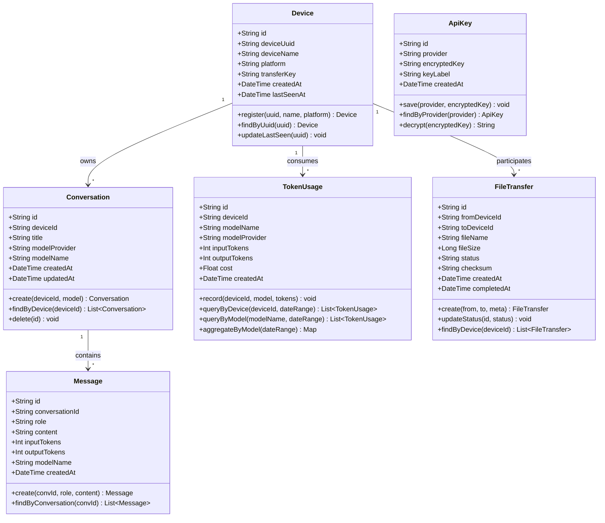
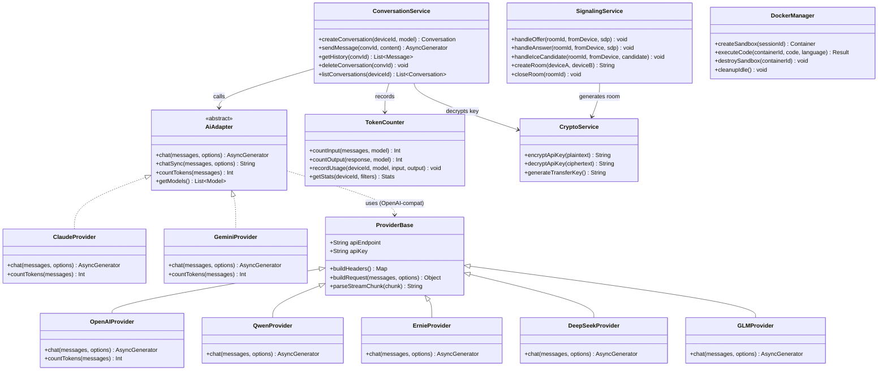
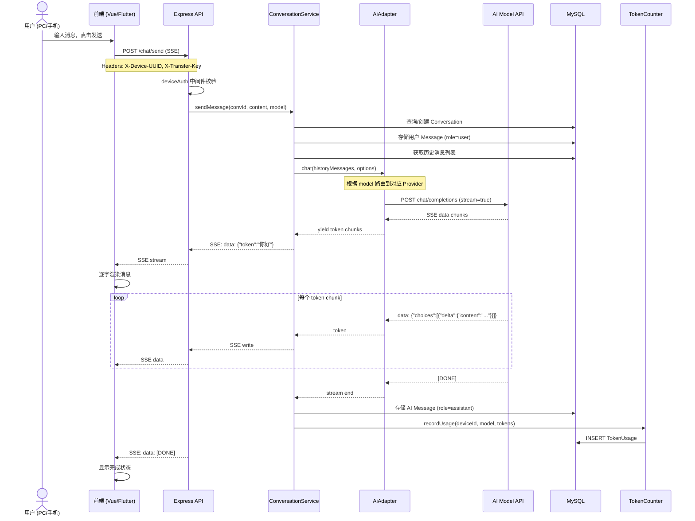
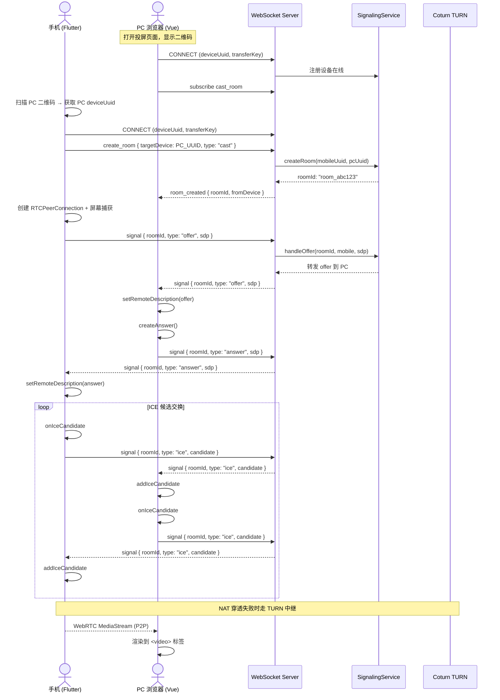
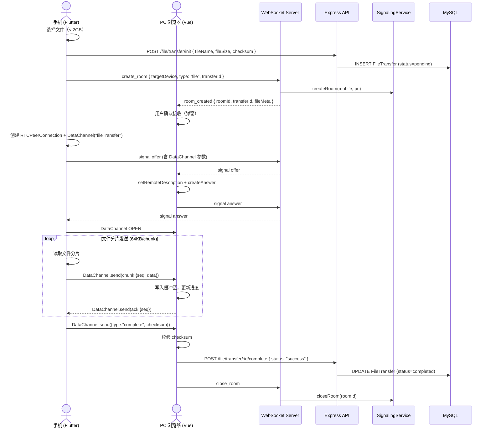
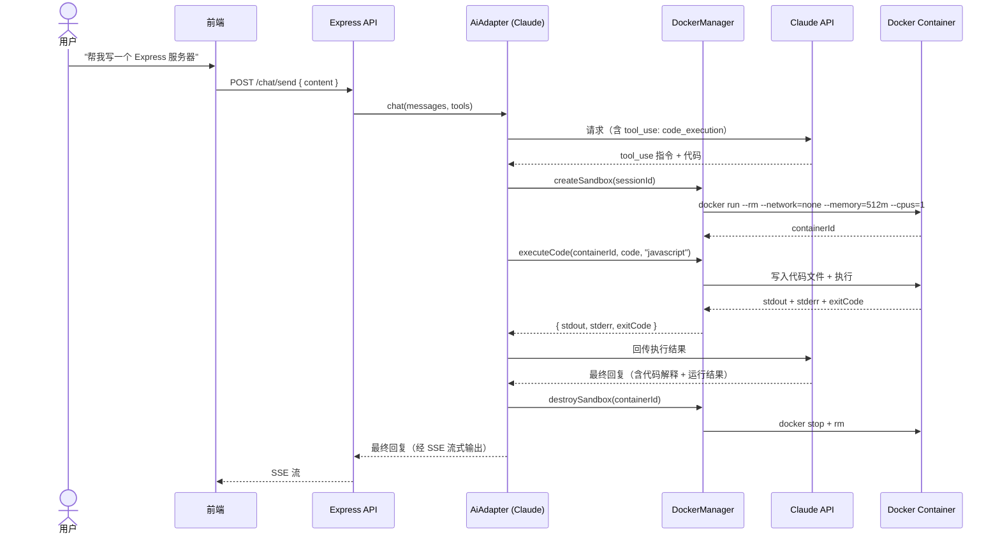
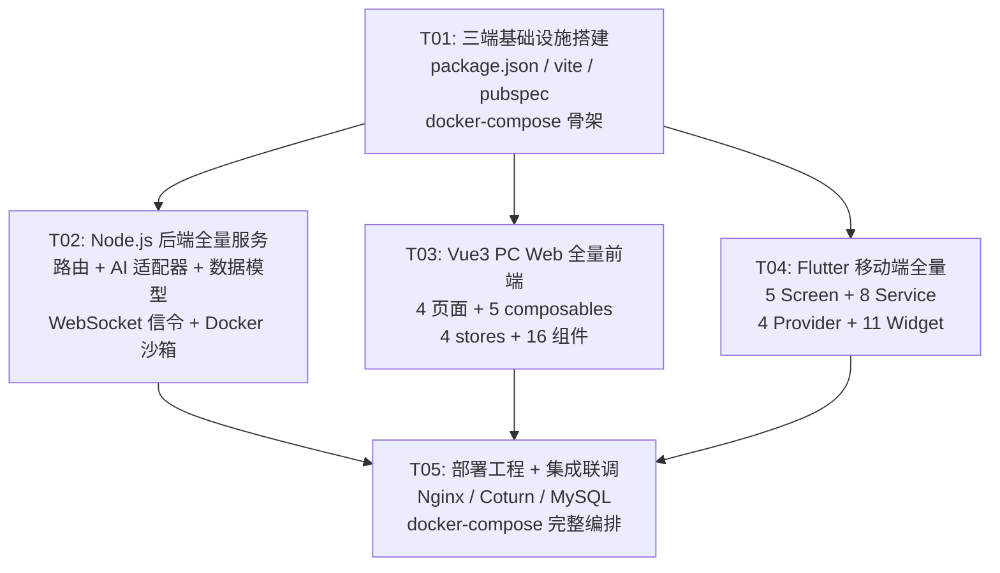

# AI Cast Hub — 系统架构设计文档

> 版本：v1.0 | 作者：Bob (架构师) | 日期：2026-06-02

---

## 目录

- [Part A：系统设计](#part-a系统设计)
  - [1. 实现方案 + 框架选型](#1-实现方案--框架选型)
  - [2. 完整文件列表](#2-完整文件列表)
  - [3. 数据结构与接口（类图）](#3-数据结构与接口类图)
  - [4. 程序调用流程（时序图）](#4-程序调用流程时序图)
  - [5. 待明确事项](#5-待明确事项)
- [Part B：任务分解](#part-b任务分解)
  - [6. 依赖包列表](#6-依赖包列表)
  - [7. 任务列表](#7-任务列表)
  - [8. 共享知识](#8-共享知识)
  - [9. 任务依赖图](#9-任务依赖图)

---

# Part A：系统设计

## 1. 实现方案 + 框架选型

### 1.1 核心技术挑战

| 挑战 | 说明 | 方案 |
|------|------|------|
| 多模型统一接入 | 需要对接 Claude/GPT/Gemini + 国内4家模型，接口各异 | 统一 Adapter 抽象层，优先 OpenAI 兼容接口，非兼容模型封装适配 |
| WebRTC 投屏 | 手机实时屏幕捕获 → PC 浏览器播放，跨平台 NAT 穿透 | 移动端 MediaProjection/ReplayKit 采集 → WebRTC P2P 推流 → PC 端 video 标签渲染；自建 Coturn 辅助 NAT 穿透 |
| 文件 P2P 传输 | 最大 2GB 单文件，无需服务器中转 | WebRTC DataChannel + 分片传输 + 断点校验，信令仅协商元数据 |
| Claude Code 沙箱执行 | AI 生成的代码需隔离执行 | Docker 容器动态创建/销毁，资源限制（CPU/内存/网络/超时），仅挂载临时工作目录 |
| SSE 流式响应 | AI 模型流式输出到多端（PC Web + Flutter 移动端） | Express SSE endpoint，前端 EventSource / Flutter http stream |
| API Key 安全 | 敏感密钥不能明文存储 | AES-256-GCM 加密存储，仅后端解密使用 |

### 1.2 框架与库选型

| 层面 | 选型 | 理由 |
|------|------|------|
| **后端运行时** | Node.js 20 LTS + Express 4.x | 生态成熟，SSE/WS 原生支持好，Docker 部署轻量 |
| **WebSocket** | `ws` 库（Node.js） | 轻量、高性能，信令场景够用 |
| **AI SDK** | 各模型官方 SDK + 统一封装 | OpenAI `openai`、Anthropic `@anthropic-ai/sdk`、Google `@google/generative-ai`；国内模型使用 OpenAI 兼容 endpoint 统一调用 |
| **数据库** | SQLite（`better-sqlite3`）+ MySQL（`mysql2`） | SQLite 做设备端本地缓存/离线元数据；MySQL 做云端持久化 |
| **加密** | Node.js 内置 `crypto` 模块 | AES-256-GCM，零额外依赖 |
| **Docker SDK** | `dockerode` | Node.js 管理 Docker 容器生命周期 |
| **TURN** | Coturn（独立容器） | 开源、成熟、支持 STUN/TURN 全协议 |
| **PC 前端** | Vue 3.4 + Vite 5 + Pinia + Vue Router 4 | 与约束一致；Vite HMR 开发体验优 |
| **PC UI** | Tailwind CSS 3.x | 原子化 CSS，快速构建响应式 UI |
| **PC WebRTC** | 浏览器原生 `RTCPeerConnection` | 无需第三方库 |
| **移动端** | Flutter 3.x（最新稳定版） | 跨平台，WebRTC 插件成熟 |
| **Flutter WebRTC** | `flutter_webrtc` | Flutter 社区首选 WebRTC 插件 |
| **Flutter 状态管理** | Riverpod 2.x | 编译安全、测试友好 |
| **Flutter HTTP** | `dio` | 拦截器、流式响应支持好 |
| **部署** | Docker + docker-compose + Nginx | 一键编排所有服务 |

### 1.3 架构模式

```
┌──────────────────────────────────────────────────────────────────┐
│                           Nginx (Reverse Proxy)                   │
│                    :443 (SSL) / :80 → 重定向 :443                 │
├───────────────────┬──────────────────┬───────────────────────────┤
│   pc-web/         │   server/:3000   │      Coturn :3478         │
│   静态资源        │   Express API    │   STUN/TURN (UDP+TCP)     │
│   (Vue SPA)       │   + WebSocket    │                           │
│                   │   + SSE          │                           │
└───────────────────┴──────────────────┴───────────────────────────┘
                            │
              ┌─────────────┴─────────────┐
              │         MySQL :3306       │
              │     (云端持久化数据库)     │
              └───────────────────────────┘
                            │
              ┌─────────────┴─────────────┐
              │   Docker Sandbox Pool     │
              │   (Claude Code 执行环境)   │
              └───────────────────────────┘

PC Web (浏览器)  ←──WebRTC P2P──→  Flutter App (手机)
       │         (投屏/文件)             │
       │                                 │
       └───── WebSocket ───────┬─────────┘
              (信令)           │
                          SSE (AI流式)
                          REST API
```

**核心设计原则**：
1. **信令走 WebSocket，媒体/文件走 WebRTC P2P**：服务器零媒体流量
2. **PC 端纯前端**：无 Electron，无本地服务，全部能力通过浏览器 API + 后端 API 实现
3. **复杂逻辑后端化**：AI 调用、加密、Token 统计、沙箱管理均在 Node.js 服务端
4. **国内模型统一 OpenAI 兼容接口**：适配层只需处理认证和 endpoint 差异

---

## 2. 完整文件列表

### 2.1 项目根目录

```
ai_cast_hub/
├── docker-compose.yml
├── .env.example
├── .gitignore
├── README.md
│
├── server/                          # Node.js 后端服务
│   ├── package.json
│   ├── .env.example
│   └── src/
│       ├── index.js                 # 服务入口
│       ├── config/
│       │   ├── index.js             # 环境变量加载、全局配置
│       │   └── database.js          # MySQL + SQLite 连接管理
│       ├── middleware/
│       │   ├── deviceAuth.js        # 设备UUID + 传输密钥认证
│       │   ├── errorHandler.js      # 统一错误处理
│       │   └── rateLimiter.js       # 接口频率限制
│       ├── routes/
│       │   ├── index.js             # 路由聚合
│       │   ├── device.js            # POST /device/register, GET /device/info
│       │   ├── chat.js              # POST /chat/send (SSE), GET /chat/conversations, DELETE /chat/conversation/:id
│       │   ├── model.js             # GET /models, POST /models/apikey
│       │   ├── file.js              # POST /file/transfer/init, GET /file/transfer/:id
│       │   └── stats.js             # GET /stats/tokens, GET /stats/tokens/:model
│       ├── services/
│       │   ├── ai/
│       │   │   ├── adapter.js       # 统一 AI 适配器入口，根据 model 路由
│       │   │   ├── providerBase.js  # Provider 基类（OpenAI 兼容协议）
│       │   │   ├── providers/
│       │   │   │   ├── openai.js    # GPT-4o / GPT-4
│       │   │   │   ├── claude.js    # Claude 3.5/4 (Anthropic SDK)
│       │   │   │   ├── gemini.js    # Gemini (Google SDK)
│       │   │   │   ├── qwen.js      # 通义千问 (OpenAI 兼容 endpoint)
│       │   │   │   ├── ernie.js     # 文心一言 (OpenAI 兼容 endpoint)
│       │   │   │   ├── deepseek.js  # DeepSeek (OpenAI 兼容 endpoint)
│       │   │   │   └── glm.js       # 智谱GLM (OpenAI 兼容 endpoint)
│       │   │   ├── conversation.js  # 对话上下文管理、多窗口会话
│       │   │   └── tokenCounter.js  # 各模型独立 Token 统计
│       │   ├── webrtc/
│       │   │   ├── signaling.js     # WebSocket 信令处理（offer/answer/ICE）
│       │   │   ├── sessionManager.js # WebRTC 会话生命周期管理
│       │   │   └── turnConfig.js    # Coturn 配置生成与分发
│       │   ├── sandbox/
│       │   │   ├── dockerManager.js # Docker 容器创建/销毁
│       │   │   └── codeExecutor.js  # 代码写入容器 + 执行 + 结果收集
│       │   ├── storage/
│       │   │   ├── fileRecord.js    # 文件传输元数据记录
│       │   │   └── tempCleanup.js   # 临时文件定时清理
│       │   └── cryptoService.js     # AES-256-GCM 加解密 API Key
│       ├── models/
│       │   ├── Device.js            # 设备模型（MySQL 持久化 + SQLite 缓存）
│       │   ├── Conversation.js      # 对话模型
│       │   ├── Message.js           # 消息模型
│       │   ├── ApiKey.js            # 加密 API Key 存储
│       │   ├── TokenUsage.js        # Token 用量统计模型
│       │   └── FileTransfer.js      # 文件传输记录模型
│       ├── ws/
│       │   ├── index.js             # WebSocket 服务初始化
│       │   ├── handler.js           # WS 消息路由分发
│       │   └── roomManager.js       # 信令房间管理（pair devices）
│       └── utils/
│           ├── logger.js            # Winston 日志
│           ├── uid.js               # UUID/短码生成
│           └── validators.js        # Joi/Zod 请求校验
│
├── pc-web/                          # Vue3 PC 前端（纯静态）
│   ├── package.json
│   ├── vite.config.js
│   ├── tailwind.config.js
│   ├── postcss.config.js
│   ├── index.html
│   └── src/
│       ├── main.js                  # Vue 应用入口
│       ├── App.vue                  # 根组件（路由视图 + 布局）
│       ├── router/
│       │   └── index.js             # Vue Router 路由定义
│       ├── stores/
│       │   ├── chat.js              # 对话状态 Pinia Store
│       │   ├── device.js            # 设备绑定状态
│       │   ├── cast.js              # 投屏接收状态
│       │   └── file.js              # 文件传输状态
│       ├── composables/
│       │   ├── useWebSocket.js      # WebSocket 连接管理 hook
│       │   ├── useWebRTC.js         # WebRTC PeerConnection 封装
│       │   ├── useSSE.js            # SSE 流式响应 hook
│       │   ├── useFileTransfer.js   # DataChannel 文件传输 hook
│       │   └── useCastReceiver.js   # 投屏接收端 hook
│       ├── views/
│       │   ├── HomeView.vue         # 首页（设备绑定 / 二维码展示）
│       │   ├── ChatView.vue         # AI 完整对话页面
│       │   ├── CastView.vue         # 投屏接收页面
│       │   └── FileTransferView.vue # 文件传输页面
│       ├── components/
│       │   ├── chat/
│       │   │   ├── ChatPanel.vue    # 对话面板容器
│       │   │   ├── ChatMessage.vue  # 单条消息气泡
│       │   │   ├── ChatInput.vue    # 输入框 + 发送
│       │   │   ├── ModelSelector.vue # 模型选择下拉
│       │   │   ├── ConversationList.vue # 左侧对话列表
│       │   │   └── TokenUsage.vue   # Token 用量面板
│       │   ├── cast/
│       │   │   ├── CastReceiver.vue # 投屏视频渲染区
│       │   │   ├── DeviceQRCode.vue # 连接二维码
│       │   │   └── ConnectionBadge.vue # 连接状态指示
│       │   ├── file/
│       │   │   ├── FileReceivePanel.vue # 文件接收面板
│       │   │   └── ProgressBar.vue  # 传输进度条
│       │   └── common/
│       │       ├── AppHeader.vue    # 顶部导航栏
│       │       ├── Toast.vue        # 通知提示
│       │       └── Spinner.vue      # 加载动画
│       ├── api/
│       │   ├── client.js            # Axios 实例 + 拦截器
│       │   ├── device.js            # 设备相关 API
│       │   ├── chat.js              # 对话相关 API
│       │   ├── model.js             # 模型管理 API
│       │   └── stats.js             # 统计 API
│       └── assets/
│           └── styles/
│               ├── main.css         # Tailwind 入口 + 全局样式
│               └── components.css   # 组件级覆盖样式
│
├── flutter-app/                     # Flutter 移动端
│   ├── pubspec.yaml
│   ├── analysis_options.yaml
│   └── lib/
│       ├── main.dart                # App 入口
│       ├── app.dart                 # MaterialApp + 路由配置
│       ├── models/
│       │   ├── device.dart          # Device 模型
│       │   ├── conversation.dart    # Conversation 模型
│       │   ├── message.dart         # Message 模型
│       │   ├── cast_session.dart    # CastSession 模型
│       │   └── file_transfer.dart   # FileTransfer 模型
│       ├── services/
│       │   ├── api_client.dart      # Dio HTTP 客户端
│       │   ├── websocket_service.dart # WebSocket 管理
│       │   ├── webrtc_service.dart  # WebRTC PeerConnection 管理
│       │   ├── cast_service.dart    # 屏幕捕获与推流
│       │   ├── file_service.dart    # 文件读取与 DataChannel 发送
│       │   ├── chat_service.dart    # AI 对话（SSE 流式）
│       │   ├── device_service.dart  # 设备注册与管理
│       │   └── local_storage.dart   # SQLite 本地存储
│       ├── providers/
│       │   ├── chat_provider.dart   # 对话状态 Riverpod Provider
│       │   ├── cast_provider.dart   # 投屏状态
│       │   ├── device_provider.dart # 设备状态
│       │   └── file_provider.dart   # 文件传输状态
│       ├── screens/
│       │   ├── home_screen.dart     # 首页（功能入口）
│       │   ├── chat_screen.dart     # AI 对话页
│       │   ├── cast_screen.dart     # 投屏发起页
│       │   ├── file_screen.dart     # 文件传输页
│       │   └── settings_screen.dart # 设置（密钥/模型管理）
│       ├── widgets/
│       │   ├── chat/
│       │   │   ├── chat_bubble.dart
│       │   │   ├── chat_input_bar.dart
│       │   │   ├── model_picker.dart
│       │   │   └── token_indicator.dart
│       │   ├── cast/
│       │   │   ├── cast_control_panel.dart
│       │   │   ├── device_scanner.dart
│       │   │   └── status_indicator.dart
│       │   ├── file/
│       │   │   ├── file_selector.dart
│       │   │   └── send_progress.dart
│       │   └── common/
│       │       ├── app_drawer.dart
│       │       └── loading_overlay.dart
│       └── utils/
│           ├── constants.dart
│           └── extensions.dart
│
└── deploy/                          # 部署工程
    ├── nginx/
    │   ├── nginx.conf               # 主配置（反向代理 + SSL + 静态资源）
    │   └── ssl/
    │       └── .gitkeep
    ├── coturn/
    │   └── turnserver.conf          # Coturn 配置文件
    ├── mysql/
    │   └── init.sql                 # 数据库初始化 DDL
    └── sandbox/
        └── Dockerfile               # Claude Code 沙箱镜像
```

---

## 3. 数据结构与接口（类图）

### 3.1 数据模型层



### 3.2 服务层



---

## 4. 程序调用流程（时序图）

### 4.1 AI 对话流（SSE 流式响应）



### 4.2 投屏（Cast）信令 + WebRTC P2P 流程



### 4.3 文件传输流程（WebRTC DataChannel）



### 4.4 Claude Code 沙箱执行流程



---

## 5. 待明确事项

| # | 事项 | 当前假设 | 影响范围 |
|---|------|---------|---------|
| 1 | 国内模型 API 兼容性 | 假设通义千问/文心一言/DeepSeek/智谱GLM 均提供 OpenAI 兼容 endpoint。部分模型可能需要额外签名逻辑。 | `providerBase.js` 和国内 provider 子类 |
| 2 | Claude Code Agent 具体能力边界 | 假设仅支持 Node.js/Python/Bash 三种运行时执行，不支持 GUI 操作。是否需要文件系统持久化待定。 | `dockerManager.js` 和 `Dockerfile` |
| 3 | iOS ReplayKit 录屏限制 | Apple 每次录屏均弹系统确认框，无法绕过。产品侧需做引导提示。 | Flutter `cast_service.dart` |
| 4 | Token 计费标准 | 各模型 Token→费用换算比例尚未确定，先按官方定价写入配置，后续可动态调整。 | `tokenCounter.js` |
| 5 | 多设备同时投屏 | 当前假设一对一 P2P，不支持一对多广播投屏。 | `sessionManager.js` |
| 6 | 文件传输断点续传 | 第一版不支持断点续传，传输中断需重新开始。 | `useFileTransfer.js` / `file_service.dart` |
| 7 | 大文件内存策略 | PC 端使用 File System Access API（如可用）流式写入，移动端分片写入临时目录。不支持全部加载到内存。 | 两个客户端的 file 模块 |

---

# Part B：任务分解

## 6. 依赖包列表

### 6.1 Server（Node.js）

```
- express@^4.18.2: HTTP 框架
- ws@^8.16.0: WebSocket 服务
- better-sqlite3@^11.0.0: SQLite 本地数据库
- mysql2@^3.9.0: MySQL 数据库驱动
- openai@^4.40.0: OpenAI SDK（GPT + 国内 OpenAI 兼容模型通用）
- @anthropic-ai/sdk@^0.25.0: Claude SDK
- @google/generative-ai@^0.10.0: Gemini SDK
- dockerode@^4.0.0: Docker 容器管理
- uuid@^9.0.0: UUID 生成
- winston@^3.12.0: 日志系统
- zod@^3.22.0: 请求参数校验
- cors@^2.8.5: 跨域中间件
- dotenv@^16.4.0: 环境变量加载
- express-rate-limit@^7.2.0: 接口限流
```

### 6.2 PC Web（Vue3）

```
- vue@^3.4.0: Vue 框架
- vue-router@^4.3.0: 路由
- pinia@^2.1.0: 状态管理
- axios@^1.6.0: HTTP 客户端
- @vueuse/core@^10.9.0: Vue 组合式工具库
- qrcode@^1.5.0: 二维码生成（用于投屏连接）
```

### 6.3 Flutter App

```
- flutter_webrtc: ^0.10.0 (WebRTC)
- dio: ^5.4.0 (HTTP + SSE)
- web_socket_channel: ^2.4.0 (WebSocket)
- flutter_riverpod: ^2.5.0 (状态管理)
- riverpod_annotation: ^2.3.0
- sqflite: ^2.3.0 (本地 SQLite)
- path_provider: ^2.1.0 (文件路径)
- qr_code_scanner: ^1.0.0 (扫码连接)
- screen_recording: ^1.0.0 (屏幕捕获，需评估具体插件)
- flutter_file_dialog: ^3.0.0 (文件选择)
- crypto: ^3.0.0 (校验和)
- permission_handler: ^11.0.0 (权限管理)
- shared_preferences: ^2.2.0 (简单 KV 存储)
```

### 6.4 部署

```
Docker 镜像:
- node:20-alpine (后端服务)
- nginx:stable-alpine (反向代理)
- mysql:8.0 (数据库)
- coturn/coturn:latest (TURN 服务)
```

---

## 7. 任务列表

### ⚠️ 重要：共 5 个任务，按实现顺序排列

| 任务 | 包含内容 | 硬约束 |
|------|---------|--------|
| **T01** | 三端基础设施搭建 | 所有配置文件、入口文件、依赖声明 |
| **T02** | 后端核心服务 | 路由、服务层、数据模型、AI 适配器、加密、WebSocket |
| **T03** | PC Web 前端全量 | 所有 Vue 组件、视图、路由、状态、composables、样式 |
| **T04** | Flutter 移动端全量 | 所有 Screen、Widget、Service、Provider、模型 |
| **T05** | 部署工程 + 集成联调 | docker-compose、Nginx、Coturn、MySQL 初始化、沙箱 Dockerfile |

---

### T01 — 项目基础设施

| 属性 | 内容 |
|------|------|
| **Task ID** | T01 |
| **任务名** | 三端项目基础设施搭建 |
| **优先级** | P0（阻塞所有后续任务） |
| **依赖** | 无 |

**源文件清单：**

```
Server:
  server/package.json
  server/.env.example
  server/src/index.js
  server/src/config/index.js
  server/src/config/database.js

PC Web:
  pc-web/package.json
  pc-web/vite.config.js
  pc-web/tailwind.config.js
  pc-web/postcss.config.js
  pc-web/index.html
  pc-web/src/main.js
  pc-web/src/App.vue
  pc-web/src/router/index.js
  pc-web/src/assets/styles/main.css

Flutter:
  flutter-app/pubspec.yaml
  flutter-app/analysis_options.yaml
  flutter-app/lib/main.dart
  flutter-app/lib/app.dart

Root:
  docker-compose.yml (骨架)
  .env.example
  .gitignore
```

**产出物描述：**
- Server：Express 启动骨架 + 中间件挂载点 + 数据库连接池初始化（SQLite + MySQL 双连接）
- PC Web：Vite + Vue3 + Tailwind 启动，路由骨架（4 个路由占位），Pinia 已挂载
- Flutter：Flutter 项目创建，MaterialApp + GoRouter 路由骨架（5 个页面占位），Riverpod 已挂载
- 根目录：docker-compose 骨架、环境变量模板

---

### T02 — 后端核心服务

| 属性 | 内容 |
|------|------|
| **Task ID** | T02 |
| **任务名** | Node.js 后端全量服务实现 |
| **优先级** | P0 |
| **依赖** | T01（需要 package.json + 数据库配置） |

**源文件清单：**

```
server/src/middleware/deviceAuth.js
server/src/middleware/errorHandler.js
server/src/middleware/rateLimiter.js
server/src/routes/index.js
server/src/routes/device.js
server/src/routes/chat.js
server/src/routes/model.js
server/src/routes/file.js
server/src/routes/stats.js
server/src/services/cryptoService.js
server/src/services/ai/adapter.js
server/src/services/ai/providerBase.js
server/src/services/ai/providers/openai.js
server/src/services/ai/providers/claude.js
server/src/services/ai/providers/gemini.js
server/src/services/ai/providers/qwen.js
server/src/services/ai/providers/ernie.js
server/src/services/ai/providers/deepseek.js
server/src/services/ai/providers/glm.js
server/src/services/ai/conversation.js
server/src/services/ai/tokenCounter.js
server/src/services/webrtc/signaling.js
server/src/services/webrtc/sessionManager.js
server/src/services/webrtc/turnConfig.js
server/src/services/sandbox/dockerManager.js
server/src/services/sandbox/codeExecutor.js
server/src/services/storage/fileRecord.js
server/src/services/storage/tempCleanup.js
server/src/models/Device.js
server/src/models/Conversation.js
server/src/models/Message.js
server/src/models/ApiKey.js
server/src/models/TokenUsage.js
server/src/models/FileTransfer.js
server/src/ws/index.js
server/src/ws/handler.js
server/src/ws/roomManager.js
server/src/utils/logger.js
server/src/utils/uid.js
server/src/utils/validators.js
```

**产出物描述：**
- 完整 REST API：设备注册、AI 对话（SSE 流式）、模型管理、文件传输协调、Token 统计
- WebSocket 信令服务：房间创建、offer/answer/ICE 候选转发
- AI 适配器层：7 个模型 Provider 统一 chat/chatStream/countTokens 接口
- 数据模型：6 个 Model（Device/Conversation/Message/ApiKey/TokenUsage/FileTransfer），均支持 MySQL 持久化 + SQLite 缓存读取
- 安全：AES-256-GCM API Key 加解密、设备级 deviceAuth 中间件
- Docker 沙箱：容器创建/代码执行/销毁生命周期管理

---

### T03 — PC Web 前端全量

| 属性 | 内容 |
|------|------|
| **Task ID** | T03 |
| **任务名** | Vue3 PC Web 全量前端实现 |
| **优先级** | P1 |
| **依赖** | T01（需要 Vite 脚手架） |

> **注：** T03 可与 T02 并行开发，前端先使用 Mock 数据；联调在 T05 阶段完成。

**源文件清单：**

```
pc-web/src/stores/chat.js
pc-web/src/stores/device.js
pc-web/src/stores/cast.js
pc-web/src/stores/file.js
pc-web/src/composables/useWebSocket.js
pc-web/src/composables/useWebRTC.js
pc-web/src/composables/useSSE.js
pc-web/src/composables/useFileTransfer.js
pc-web/src/composables/useCastReceiver.js
pc-web/src/views/HomeView.vue
pc-web/src/views/ChatView.vue
pc-web/src/views/CastView.vue
pc-web/src/views/FileTransferView.vue
pc-web/src/components/chat/ChatPanel.vue
pc-web/src/components/chat/ChatMessage.vue
pc-web/src/components/chat/ChatInput.vue
pc-web/src/components/chat/ModelSelector.vue
pc-web/src/components/chat/ConversationList.vue
pc-web/src/components/chat/TokenUsage.vue
pc-web/src/components/cast/CastReceiver.vue
pc-web/src/components/cast/DeviceQRCode.vue
pc-web/src/components/cast/ConnectionBadge.vue
pc-web/src/components/file/FileReceivePanel.vue
pc-web/src/components/file/ProgressBar.vue
pc-web/src/components/common/AppHeader.vue
pc-web/src/components/common/Toast.vue
pc-web/src/components/common/Spinner.vue
pc-web/src/api/client.js
pc-web/src/api/device.js
pc-web/src/api/chat.js
pc-web/src/api/model.js
pc-web/src/api/stats.js
pc-web/src/assets/styles/components.css
```

**产出物描述：**
- 4 个页面：Home（设备绑定/二维码）、Chat（完整 AI 对话）、Cast（投屏接收）、FileTransfer（文件接收）
- 复合组件 ChatPanel（对话列表 + 消息面板 + 输入框 + 模型选择器 + Token 用量）
- WebSocket composable：自动重连、心跳保活
- WebRTC composable：RTCPeerConnection 封装，支持 video track 渲染 + DataChannel 文件接收
- SSE composable：EventSource 管理，自动重连
- 文件接收：File System Access API（Chrome/Edge）流式写入，降级方案 Blob 内存 + 下载链接
- Pinia Store：4 个 Store（chat/device/cast/file），与 composables 解耦

---

### T04 — Flutter 移动端全量

| 属性 | 内容 |
|------|------|
| **Task ID** | T04 |
| **任务名** | Flutter 移动端全量实现 |
| **优先级** | P1 |
| **依赖** | T01（需要 pubspec.yaml + 项目骨架） |

> **注：** T04 可与 T02/T03 并行开发，先使用 Mock 数据；联调在 T05 阶段完成。

**源文件清单：**

```
flutter-app/lib/models/device.dart
flutter-app/lib/models/conversation.dart
flutter-app/lib/models/message.dart
flutter-app/lib/models/cast_session.dart
flutter-app/lib/models/file_transfer.dart
flutter-app/lib/services/api_client.dart
flutter-app/lib/services/websocket_service.dart
flutter-app/lib/services/webrtc_service.dart
flutter-app/lib/services/cast_service.dart
flutter-app/lib/services/file_service.dart
flutter-app/lib/services/chat_service.dart
flutter-app/lib/services/device_service.dart
flutter-app/lib/services/local_storage.dart
flutter-app/lib/providers/chat_provider.dart
flutter-app/lib/providers/cast_provider.dart
flutter-app/lib/providers/device_provider.dart
flutter-app/lib/providers/file_provider.dart
flutter-app/lib/screens/home_screen.dart
flutter-app/lib/screens/chat_screen.dart
flutter-app/lib/screens/cast_screen.dart
flutter-app/lib/screens/file_screen.dart
flutter-app/lib/screens/settings_screen.dart
flutter-app/lib/widgets/chat/chat_bubble.dart
flutter-app/lib/widgets/chat/chat_input_bar.dart
flutter-app/lib/widgets/chat/model_picker.dart
flutter-app/lib/widgets/chat/token_indicator.dart
flutter-app/lib/widgets/cast/cast_control_panel.dart
flutter-app/lib/widgets/cast/device_scanner.dart
flutter-app/lib/widgets/cast/status_indicator.dart
flutter-app/lib/widgets/file/file_selector.dart
flutter-app/lib/widgets/file/send_progress.dart
flutter-app/lib/widgets/common/app_drawer.dart
flutter-app/lib/widgets/common/loading_overlay.dart
flutter-app/lib/utils/constants.dart
flutter-app/lib/utils/extensions.dart
```

**产出物描述：**
- 5 个 Screen：Home/ Chat/ Cast/ File/ Settings
- 8 个 Service：API Client（Dio + 拦截器）、WebSocket（自动重连）、WebRTC（flutter_webrtc 封装）、Cast（屏幕捕获 + MediaStream）、File（DataChannel 分片发送 64KB/chunk）、Chat（SSE 流式解析）、Device（注册 + UUID 持久化）、LocalStorage（sqflite）
- 4 个 Riverpod Provider：Chat/Cast/Device/File 状态管理
- Settings 页面：API Key 管理（添加/删除/切换模型）、传输密钥重置、设备信息
- 文件选择器：文件大小校验（< 2GB）+ checksum 计算

---

### T05 — 部署工程 + 集成联调

| 属性 | 内容 |
|------|------|
| **Task ID** | T05 |
| **任务名** | Docker 部署 + Nginx + Coturn + 全端集成 |
| **优先级** | P0 |
| **依赖** | T02, T03, T04（需要所有子项目完成） |

**源文件清单：**

```
docker-compose.yml (完整版)
deploy/nginx/nginx.conf
deploy/nginx/ssl/.gitkeep
deploy/coturn/turnserver.conf
deploy/mysql/init.sql
deploy/sandbox/Dockerfile
server/Dockerfile
.env.example (补充部署相关变量)
```

**产出物描述：**
- `docker-compose.yml`：5 个服务编排
  - `nginx`：反向代理 → server:3000，托管 pc-web 静态资源，SSL 终止
  - `server`：Node.js 后端，挂载 SQLite 数据卷
  - `mysql`：MySQL 8.0，挂载 init.sql 初始化表结构，数据持久化卷
  - `coturn`：STUN/TURN 服务，暴露 3478(UDP+TCP) + 49152-65535(UDP 中继端口)
  - `sandbox-builder`：预构建 Claude Code 沙箱 Docker 镜像
- `deploy/mysql/init.sql`：6 张表 DDL + 索引
- `deploy/nginx/nginx.conf`：SSL 配置 + API 反向代理 + 静态资源 + WebSocket Upgrade + SSE 长连接支持（proxy_buffering off）
- `deploy/coturn/turnserver.conf`：TURN 认证配置 + 端口范围
- `deploy/sandbox/Dockerfile`：基于 `node:20-alpine`，预装 Python3 + Bash，资源限制配置
- 集成联调：验证全链路（设备注册 → AI 对话 → 投屏 → 文件传输 → Token 统计）

---

## 8. 共享知识

以下约定适用于所有子项目，工程师必须遵守：

### 8.1 API 协议

```
所有 REST API 响应格式:
{
  "code": 0,           // 0=成功, 非0=错误码
  "data": {},          // 业务数据
  "message": "ok"      // 提示信息
}

WebSocket 消息格式:
{
  "type": "signal",        // 消息类型
  "roomId": "room_xxx",    // 房间 ID
  "payload": {}            // 载荷
}

SSE 格式:
data: {"token": "你好"}    // 逐 token 流式
data: {"type": "tool_use", "name": "code_execution", ...}
data: [DONE]               // 流结束标记

认证头:
X-Device-UUID: <设备UUID>
X-Transfer-Key: <传输密钥>
```

### 8.2 数据传输约束

- **文件传输**：DataChannel 分片大小 64KB，JSON 消息头 `{type, seq, total}` + ArrayBuffer 载荷
- **WebRTC**：强制使用 `Trickle ICE`，coturn 作为后备中继
- **超时**：WebSocket 心跳 30s，SSE 超时 300s，WebRTC ICE 超时 30s

### 8.3 数据库

- **MySQL 表**：`devices`, `conversations`, `messages`, `api_keys`, `token_usages`, `file_transfers`
- **SQLite 缓存表**：`devices`（缓存最近设备信息），`token_usages`（本地累积，定期同步 MySQL）
- **时间字段**：统一使用 ISO 8601 UTC 格式存储（`DATETIME` 类型）

### 8.4 加密

- API Key 加密：AES-256-GCM，密钥由环境变量 `ENCRYPTION_KEY` 提供（32 字节 hex）
- 传输密钥：随机生成 32 字符 alphanumeric，注册时返回给设备，设备本地持久化

### 8.5 模型统一标识

```
model = {provider}:{modelName}
示例:
  openai:gpt-4o
  claude:claude-3-5-sonnet-20241022
  gemini:gemini-1.5-pro
  qwen:qwen-max
  ernie:ernie-4.0
  deepseek:deepseek-chat
  glm:glm-4
```

### 8.6 Token 统计

- 按 `{provider}:{modelName}` 维度独立统计
- 每次 AI 对话完成后写入 `token_usages` 表
- Token 计数方式：
  - GPT/国内 OpenAI 兼容模型：从 API response 的 `usage` 字段直接获取
  - Claude：从 API response 的 `usage` 字段获取
  - Gemini：从 API response 获取或本地估算

---

## 9. 任务依赖图



**并行策略说明：**
- T02、T03、T04 在 T01 完成后可**完全并行**开发
- 前后端独立开发时使用 Mock 数据，联调集中在 T05
- T05 是唯一的串行瓶颈，等待 T02/T03/T04 全部完成后执行

---

> **文档结束。** 下一步：工程师依据本设计文档按 T01→T02→T03→T04→T05 顺序实施。
